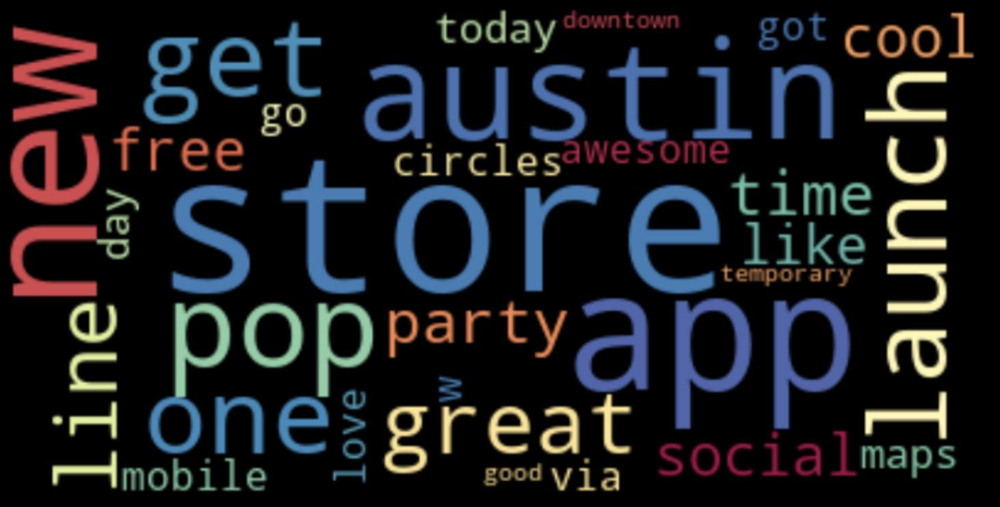

# Tweets Sentiment Analysis
### By Jagandeep Singh

For this project, objective is to perform supervised sentiment analysis on tweets about google and apple products. The dataset had tweets and sentiment(Positive, Negative and Neutral) as target variable. 

